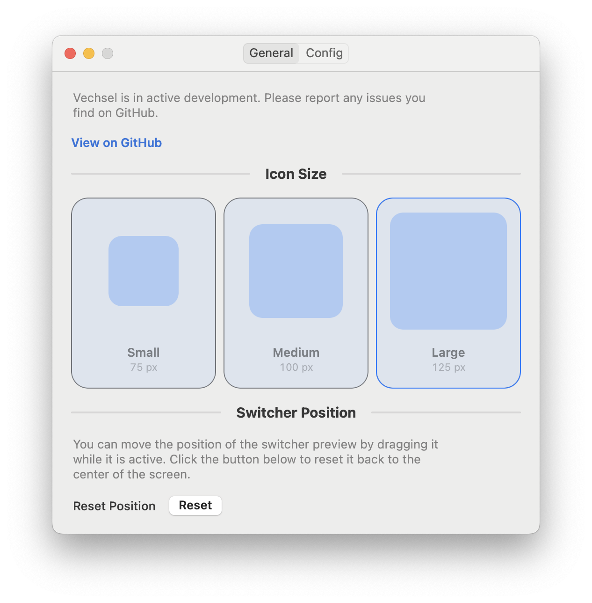
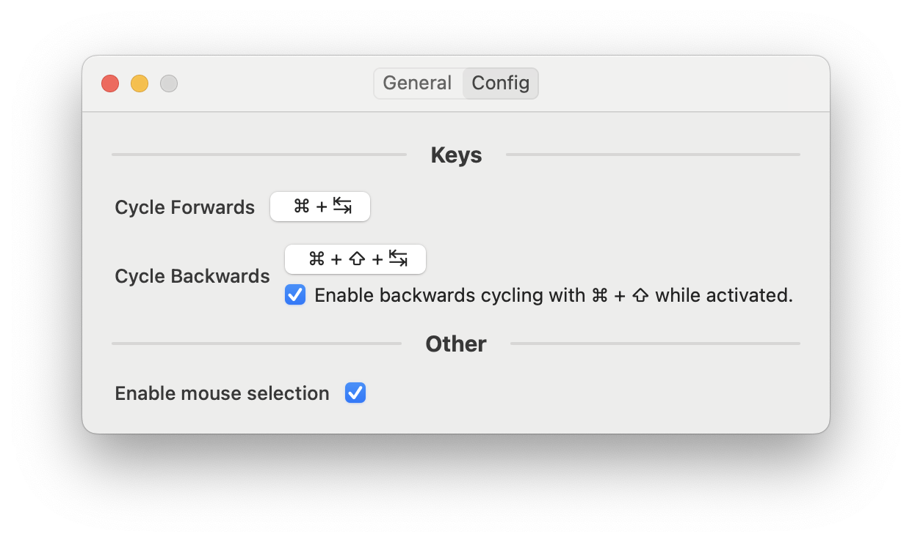
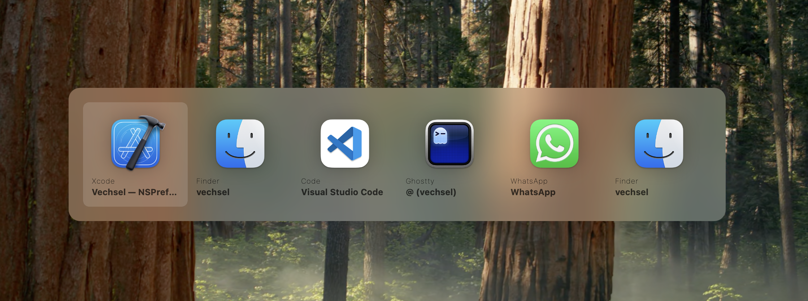
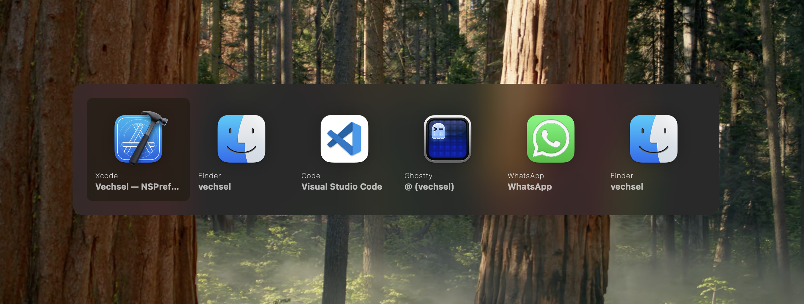

# Vechsel
A window based application switcher for macOS inspired by [AltTab](https://alt-tab-macos.netlify.app/). This is a simplified and lightweight utility that focuses on consistent workflows.

Given the restrictions of macOS, Vechsel utilises many of the same techniques as other window switcher software uses. The focus is a window switcher that only provides the absolute essentials and does not include any additional features like window previews or animations. It is designed to be fast and lightweight, while still providing a good user experience.

## Installation
Install from the [GitHub Releases](https://github.com/itsbjoern/vechsel/releases) page.

## Preferences
Vechsel can be configured in multiple sizes in the system preferences. It's appearance is automatically based on the system theme (light or dark mode). The actual window switching view can be repositioned by dragging it around.

### Key Bindings
The key bindings can be configured in the preferences. The default key binding is `Cmd + Tab` to switch to the next window and `Control + Shift + Tab` to switch to the previous window. This overrides the default macOS behavior, so you can use Vechsel instead of the built-in application switcher.

An additional feature is that once the switcher is open, you can use `Cmd + Shift` to cycle backwards instead of having to invoke the whole reverse sequence with `Cmd + Shift + Tab`.

## The switcher window
When the command is invoked, a preview appears showing all open windows / applications of the current application. Note, that Vechsel does not show screenshots of the windows, it only shows the application icons and the window titles. This is to keep the application lightweight and fast. Please check out the [AltTab](https://alt-tab-macos.netlify.app/) application if you prefer a more feature-rich experience with window previews.

### Light mode

### Dark mode

