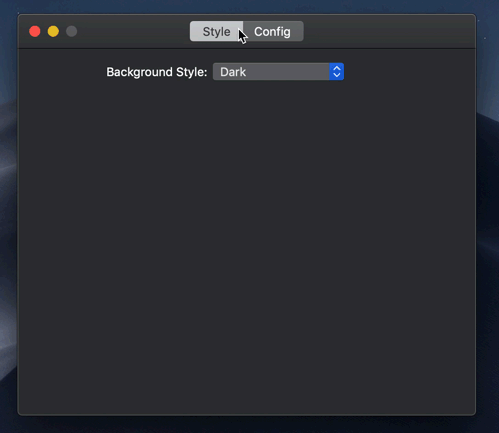

# NSPreferenceController

A quick and easy way for creating a tabbed preference window.



## API

Simply extend the NSViewController you want to use as a preference pane with the PreferencePane protocol.

Then initialise the NSPreferenceController with the instances of your panes. A window will be created automatically.

---

### PreferencePane

Extension of `NSViewController`.

```swift
  // required
  var preferenceTabTitle: String { get }

  // optional
  func paneWillAppear(inWindowController windowController: NSPreferenceController)
  func paneDidAppear(inWindowController windowController: NSPreferenceController)

  func paneWillDisappear()
  func paneDidDisappear()
```

---

### NSPreferenceController

Extension of `NSWindowController`.

```swift
  init(panes: [PreferencePane])

  // The current tab index
  var index: Int { get }
  // A programmatic way to set the tab
  func setTab(index: Int, animated: Bool = true)

  // Optional methods to perform actions when window is about to show / close
  func preferenceWindowWillShow(withPane pane: PreferencePane)
  func preferenceWindowWillClose(withPane pane: PreferencePane)
```

## Example

```swift
  // StyleViewController.swift
  class StyleViewController : NSViewController, PreferencePane {
    var preferenceTabTitle = "Style"

    override func loadView() {
        self.view = NSView(frame: NSMakeRect(0, 0, 500, 400))
    }
  }

  // ConfigViewController.swift
  class ConfigViewController : NSViewController, PreferencePane {
    var preferenceTabTitle = "Config"

    override func loadView() {
        self.view = NSView(frame: NSMakeRect(0, 0, 300, 300))
    }
  }

  // PreferenceController.swift
  class PreferenceController: NSPreferenceController {
    init() {
        super.init(panes: [
            StyleViewController(),
            ConfigViewController()
        ])
    }
  }

  // AppDelegate.swift
  class AppDelegate: NSObject, NSApplicationDelegate {
    lazy var preferenceController = PreferenceController()

    // [...]

    func showPreferences() {
      // Use NSWindowController.showWindow
      preferenceController.showWindow(nil)
    }
  }
```